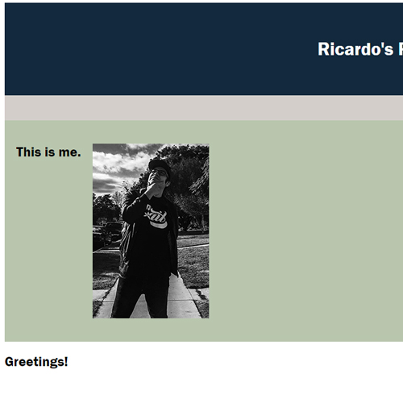

# Ricardo's Portfolio

## Description

This is a short bio/description of my portfolio. It includes links to things that I do my present day life.
Organizations I'm apart of as well as music. I made this to be easily understood and easily accessible. It also
contains my first deployed assignment because I do not have an app 

## Table of Contents 

- [Installation](#installation)
- [Usage](#usage)
- [Credits](#credits)

## Installation

No steps are required, however, you'll need a browswer to view my project.

## Usage

Both ready for web or digital device. Screen will flex to whatever your phones needs are. 

    ```md
    
    ```

## Credits

I credit the courses, I had to go back and forth from other projects/activities to make the base of mine so that it may satisfy the requierements.
